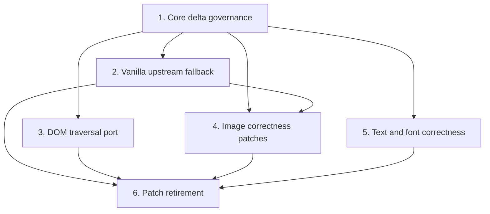

# 最大化上游兼容架构设计

## Design Principles

1. 行为正确性优先于 diff 数量。
2. 产品策略向外层移动，通用机制才进入核心。
3. 所有核心差异都有来源、测试、责任人和删除条件。
4. 稳定版兼容是日常硬门；`upstream/main` 是提前预警，并在同步 PR 上成为硬门。
5. 上游贡献按单一能力拆分，避免把 fork 的产品上下文带入补丁。

## Target Architecture

```mermaid
flowchart LR
  S[latest stable upstream] --> M[compatibility matrix]
  U[upstream/main] -. advisory or sync gate .-> M
  M --> C[@figit/dom-to-figma core]
  R[registered temporary patches] --> C
  C --> B[single dom-to-figma bridge]
  F[adapter-owned fallbacks] --> B
  B --> A[browser-capture-adapter]
  A --> E[extension consumers]
  T[parity and package tests] --> M
```

The core remains replaceable by a vanilla upstream build. Browser-only preparation, capability negotiation, retries, placeholders, and extension policy live behind the single bridge. Temporary core patches are treated as expiring inventory rather than permanent fork architecture.

## Workstream Dependencies



- Governance lands first so every later core edit is measured and authorized.
- DOM traversal and text/font work may proceed independently after governance.
- Image retirement depends on an adapter fallback because staged image preparation is currently a hard core capability.
- Retirement only removes a patch after its replacement is available in the selected upstream baseline and all behavior gates pass.

## Compatibility Matrix

| Target | Day-to-day changes | Upstream sync PR | Purpose |
| --- | --- | --- | --- |
| Fork workspace | Blocking | Blocking | Protect the shipping product |
| Latest stable upstream package | Blocking | Blocking | Keep the adapter usable with a released vanilla upstream |
| Local `upstream/main` snapshot | Advisory | Blocking | Detect incoming breakage before intake |

Each matrix cell records the exact upstream ref or package version, capability detection result, package tests, and parity outcome. A moving branch name without its resolved commit is not valid evidence.

## Core Delta Contract

The governance task will define one machine-readable entry per authorized production-code delta. At minimum each entry contains:

- stable identifier and capability;
- affected paths and originating fork commits;
- generic-versus-product classification;
- test coverage and compatibility targets;
- upstream issue/PR preparation state;
- owner, expiry review date, and removal condition.

The gate compares the selected upstream baseline with the fork. Registered changes may remain within their declared path scope; a new or expanded production delta fails. Tests and fixtures remain visible in reporting but are governed separately from the strict production-code budget.

## Upstream Contribution Boundary

An upstream-ready unit contains one generic behavior change, focused tests, compatibility rationale, and PR text. It must not depend on the extension, private fixtures, staged capture orchestration, or fork branding. Creating these local artifacts is authorized; publishing a branch or PR to upstream is a separate external action requiring explicit approval.

## Failure And Rollback Policy

- A failing stable-version cell blocks the originating change.
- A failing `upstream/main` advisory cell opens a tracked compatibility item; it blocks only an upstream sync PR.
- A parity or behavioral regression blocks patch deletion even when a delta budget would otherwise be missed.
- If upstream accepts a semantically different implementation, adapt the outer bridge first, prove parity, then remove the local patch in a separate commit.
- Sync work continues on `sync/upstream-YYYYMMDD`; fork `main` is never used as the conflict-resolution workspace.

## Decision Ownership

Child tasks own implementation and evidence for their capability. The parent owns cross-task ordering, target-version selection, budget reporting, and final acceptance. The user retains authority for starting implementation, pushing remote branches, and submitting upstream PRs.
